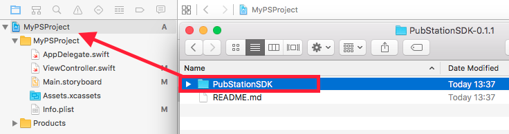
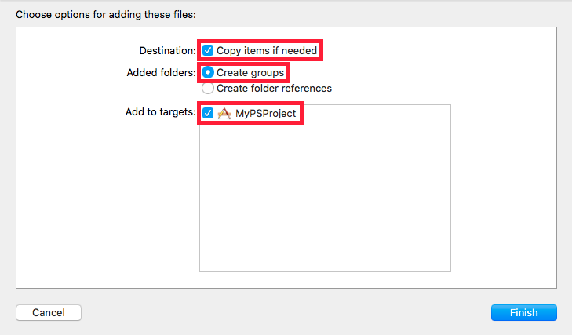
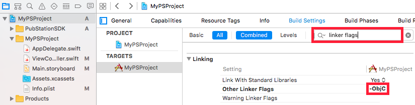
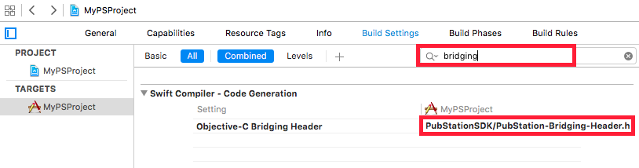
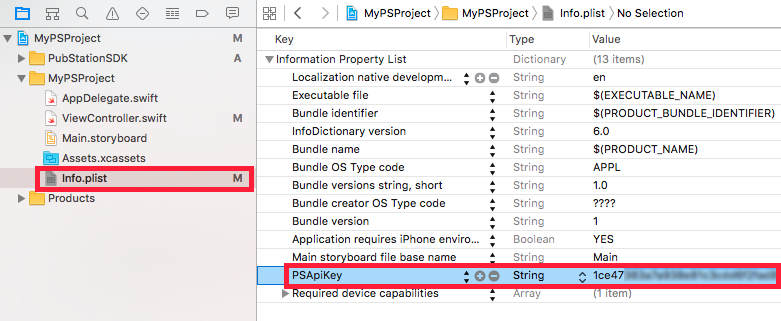

PubStation tvOS SDK
===================

Thank you for downloading the PubStation tvOS SDK! With us, you will be able to monetize your cool new Apple TV
app with only a few lines of code. 

If you didn't sign up for a PubStation account yet, visit our website at http://pubstation.tv.

Download
--------

The latest version of the SDK can be always found at https://github.com/PubStation/PubStation-tvOS-SDK.

Requirements
------------

For using the SDK, your app needs to be written in Objective-C or Swift and your target platform is required
to be tvOS 9.0 or higher (so basically any fourth generation Apple TV and up).

Integration
-----------

Integrating our SDK to your tvOS project is very simple; the basic steps are the following:

1. Register for a PubStation account at http://pubstation.tv. Download our SDK and extract it to a folder of your choice.

2. Drag & drop the folder PubStationSDK from Finder into your Xcode project.

   

   Make sure **Copy items if needed** is activated, as well as **Create groups** and that your project target is
   selected in **Add to targets**.

   

3. In the build settings of your project, set the flag

   ```
    -ObjC
   ```

   in **Other Linker Flags** in the **Linking** section (you can find it easily if you type in "linker flags"
   in the search bar).

   

4. In case you are using **Swift**, you need to add the PubStation bridging header to your
   **Objective-C Bridging Header** setting in the section **Swift Compiler - Code generation** in the build
   settings of your project (you can find it easily by typing in "bridging" in the search bar).
   Set this setting to the value

   ```
    PubStationSDK/PubStation-Bridging-Header.h
   ```

   


   Alternatively, if you are already having a bridging header in your project, just import the bridging header
   file into the bridging header of your project.

5. In the **Info.plist** of your project, create a new row of type **String** with the key **PSApiKey**.
   Login into your PubStation account in a browser and find your SDK key. Copy your SDK key and paste it
   as a value to your just newly created entry.

   

6. **Congratulations! You are now ready to use the PubStation SDK and monetize your app :)**

7. The simplest way to play an ad is the following (example is in Swift, but works exactly the same in Objective-C).
   First, you need to intitialize the SDK, for example in the **viewDidLoad()** method of your ViewController (or any 
   other place in which initialization of your app happens):

   ```swift
    // Creates a singleton instance of the interstitial ad manager.
    // In the simplest case (like here) this only informs the PubStation
    // SDK to create a interstitial ad manager with default settings.
    // We can retrieve this singleton instance later at any point in
    // the code by calling this method again.
    //
    // NOTE: Since we use default settings, the SDK will start fetching
    // interstitial ads in the background automatically.

    //PubStationSDK.setEnableLogs(true) // uncomment this line if you want to see log messages in the console

    // Initialize the PubStation SDK (automatically) with default settings
    PubStationSDK.getInterstitialAdManager()
   ```

   This will create a new singleton instance of the interstitial ad manager with default settings.
   You can call this function now at any time again to retrieve exactly this instance.
   With default settings, the SDK will now start to fetch ads in the background.
   If you want to see log messages in the console, uncomment the line `swift PubStationSDK.setEnableLogs(true)`
   in the previous example. 
   
   If you want to play an interstitial ad, you can check if an ad is already ready to play
   and if this is the case, play the ad:

   ```swift
    // Retrieve interstitial ad manager we created in the previous step.
    let manager = PubStationSDK.getInterstitialAdManager()

    // Check if ad is ready for playing and if yes play ad.
    if(manager.isAdReady()) {
        manager.showVideoAd()
    }
   ```

8. **Awesome, you just played your first interstitial ad! :)**

9. After running your app with the PubStation SDK integrated for the first time, it will
   appear automatically in your PubStation dashboard (shouldn't take longer than a few minutes).
   To see statistics about your app or to configure it, login into your PubStation account.
